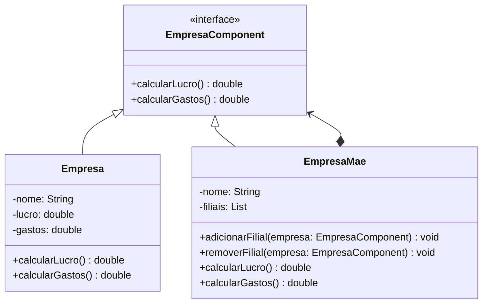

# Composite
Composite é um Design Pattern que aplica a recursividade para retornar um calor comum em todas as entidades.
Ex: Retornar a soma do lucro total de diferentes variações de um modelo de carro.

## Diagrama UML
