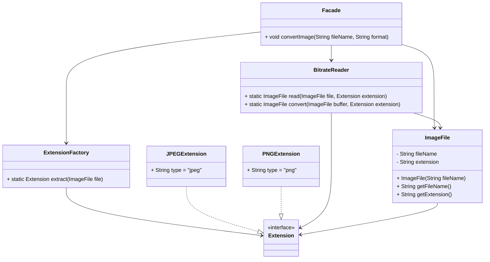

# Facade

```mermaid
classDiagram
    class Facade {
        + void convertImage(String fileName, String format)
    }

    class ImageFile {
        - String fileName
        - String extension
        + ImageFile(String fileName)
        + String getFileName()
        + String getExtension()
    }

    class BitrateReader {
        + static ImageFile read(ImageFile file, Extension extension)
        + static ImageFile convert(ImageFile buffer, Extension extension)
    }

    class ExtensionFactory {
        + static Extension extract(ImageFile file)
    }

    class Extension {
        <<interface>>
    }

    class JPEGExtension {
        + String type = "jpeg"
    }

    class PNGExtension {
        + String type = "png"
    }

    Facade --> ImageFile
    Facade --> ExtensionFactory
    Facade --> BitrateReader
    ExtensionFactory --> Extension
    JPEGExtension ..|> Extension
    PNGExtension ..|> Extension
    BitrateReader --> Extension
    BitrateReader --> ImageFile
    ImageFile --> Extension

```