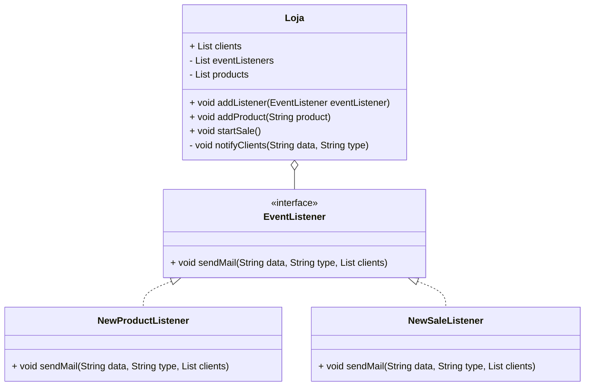

# Observer

Observer é um Design Pattern que busca otimizar a atualização de informações pertinentes, como o placar de um jogo de
futebol, quando determinado evento ocorre (um jogador marcou um gol, por exemplo)

## Diagrama UML

