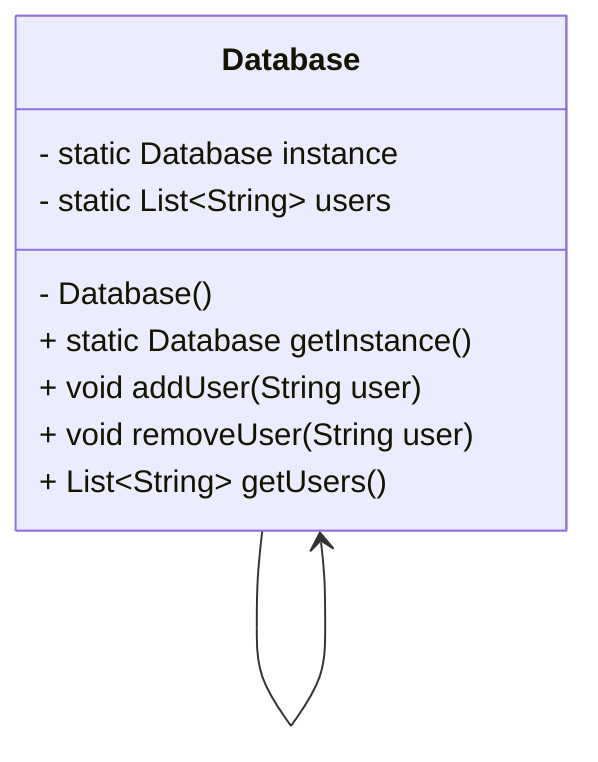

# Singleton

```mermaid
classDiagram
    class Database {
        - static Database instance
        - static List~String~ users
        - Database()
        + static Database getInstance()
        + void addUser(String user)
        + void removeUser(String user)
        + List~String~ getUsers()
    }

    Database --> Database
```
