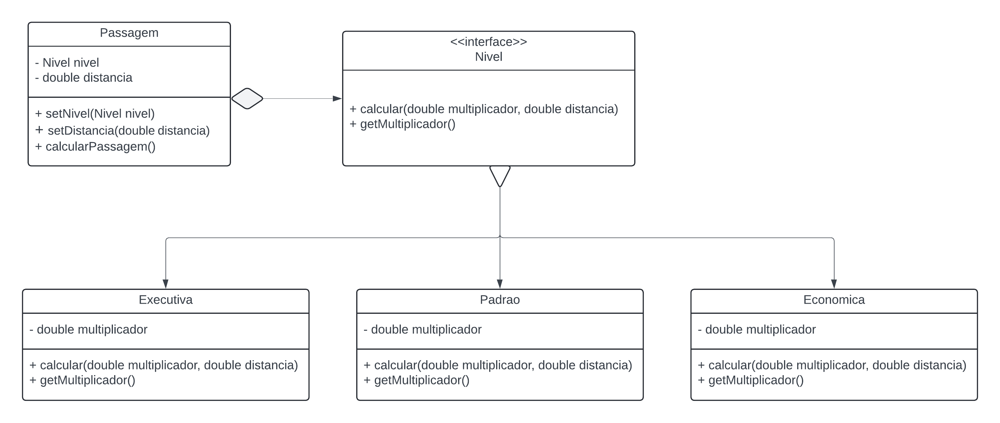

# Strategy
Strategy é um Design Pattern que busca relacionar entidades de uma forma melhor do que a Herança, removendo código redundante das classes filhas.
Para atingir esse objetivo, é utlizada uma interface. 
- A classe principal é chamada de Contexto(Context)
- As classes filhas são chamadas de Estratégias(Strategies).

## Diagrama UML
